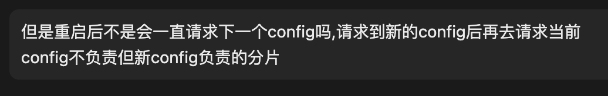

CreateAt: 2023.4.9 周日 下午 17.31
## 分片的容错kv存储系统
每一个分片kv服务器作为复制组的一部分进行操作。
听起来像 Lab4A 一样，利用raft同步即可。
#### 如何定位key所处分片？
使用cleint.go中的key2shard()方法来查找这个键是属于哪一个分片的。
#### 如何联系对应分片？
利用 分发器 分发 **配置信息**，当发生变化时，副本组必须交出分片，同时确实客户端不会看到不一致的响应，也就是保证 线性一致性。
通过得到配置信息，利用 `make_end(serverName)`得到真实地址即可。
## Task 1:
单个shardkv, 单个分片分配

1. 检查什么时候发生配置
2. 接受匹配当前分片的key，也就是不判断？

我这个已经写了3遍了(早知道写了这么多，早早写个借口，也不用担心错误），核心就是三个。
```go
type SingleExec interface {
    IxExec(args any) bool // 是否执行
    Exec(args any, op func() any) // 开始执行
    GetIfExec(args any) (any, bool) // 获取之前的结果
}

type singleExec struct {
	Result map[ClientID]map[int64]OpReply  // id, seq reply
	IsExec map[ClientID]map[int64]struct{} // id, seq isExec
}

func (s *singleExec) GetIfExec(args any) (any, bool) {
	if s.IxExec(args) {
		id := args.(OpArgs).ClientID
		seqNum := args.(OpArgs).SeqNum
		return s.Result[id][seqNum], true
	}
	return nil, false
}

func (s *singleExec) IxExec(args any) bool {
	id := args.(OpArgs).ClientID
	seqNum := args.(OpArgs).SeqNum
	if cExec, ok := s.IsExec[id]; ok {
		if _, ok = cExec[seqNum]; ok {
			return true
		}
	} else {
		s.IsExec[id] = map[int64]struct{}{}
	}

	return false
}

func (s *singleExec) Exec(args any, op func() any) {
	id := args.(OpArgs).ClientID
	seqNum := args.(OpArgs).SeqNum
	if s.IxExec(args) {
		return
	}
	data := op()

	s.IsExec[id][seqNum] = struct{}{}

	if s.Result[id] == nil {
		s.Result[id] = map[int64]OpReply{}
	}
	s.Result[id][seqNum] = data.(OpReply)
}

func NewSingleExec() SingleExec {
	return &singleExec{
		Result: map[ClientID]map[int64]OpReply{},
		IsExec: map[ClientID]map[int64]struct{}{},
	}
}


```
哈哈哈，还是将他删除了改为 只维护最后一个不是get操作的返回结果。


其实Task1核心就是一个通过 Raft 来将自己维护的配置信息在集群内同步起来，达到高可用的效果，当然为了简化，我们将读也放入，和上一个lab一样，利用raft层来保证线性一致性。

### 重新分配
因为测试代码检查的
Task2:
保证在各个集群在最新的配置下进行服务，客户端每次都会请求最新的配置，保证线性一致性，以及各个分片服务的正确性（只服务自己的）。
### 配置更新
#### 如何感知配置更新
定时轮训拉取配置，实时性挺强的。
#### 如何应用配置
当分片的拥有权打乱之后，必须进行服务器之间的通信来传递分片。
规定一个方向，也就向别人索取，push/pull 都一样。

#### 配置拉取超时
不停的重试，所以我们启动一个后台监控G，来感知当前有哪些需要拉取的分片，因为我们需要获取地址，所有需要保留上一个配置。
我们需要了解再上一个配置下，是谁有这个分片的使用权。
### rpc 拉取配置
#### 问题： 这里的索取需要利用 raft 来进行同步吗？
需要，保证线性一致性。例子：  put, applyConfig 但是 put 还没有提交，config更新了，另一个group没有这条命令，等于丢失。
那么考虑在索取的时候检查这里的配置是否是我们需要的，还需要维护一个版本号（configNum)为每个分片。
#### 接收到配置之后 传入 raft
前提：

1. 配置号连续
2. 同步分片要么为`Have`要么为 `NotHave`的状态（ 如果没有将数据拉取完，那可不能变更配置）
> 这里需要注意， config num 也要有序，我们要保证连续性，也就是我们只会拉取next = curNum + 1
> 我们通过 raft保证发送到raft里面的命令时有顺序的，但是外面的事没有的

将配置全部发送到 raft，因为这里的送入是无法感知到是否这条 log 已经被提交，同步集群状态，所以我们只是单纯的拉取。因为可能重复拉取，需要保证应用的幂等性。
⚠️： 因为我们这里是采取 pull 的方式，所以需要在消费这条日志的时候，判断自己是否是被拉取的一方，如果是，立即更新**不再服务的分片信息**。
如果是需要拉取，不要更新，因为这时候还没有 分片的信息， 需要等到 拉取的信息存入，我们才能更新。

### 应用配置
#### 考虑如何更新shard
我们 move shard 的粒度时某个分片，那么我们需要维护某个分片的state。
我们只需要记录当前这些分片的状态是否是我们拥有的即可。
```go
ShardState [Nshards]int
// NoHave, Have 
```
`Nohave`: 说明没有这个分片，返回WrongGroup
`Have`: 说明有，操作.
`Pulling`：拉取
当拉取的消费者，消费完毕之后需要将状态改变，拉取的时候需要判断 `ShardState`还有没有 `Pulling`的状态。

### 拉取分片的消费者
他的职责就是定时检查是否有要 pull 的
```go
for{
    time.Sleep(...)
    needPullingShards:=getShardsByState(Pulling)
	if len(needPullingShards) == 0{
    	continue
    }
    //call pull
}
```

两个挑战
其实核心就是维护分片状态
维护分片状态
新增删除一个状态
新增确认接受一个状态
并且将原来的 Have/NotHave -> Own
通过配置判断是否属于自己
确认接受也需要一个消费者
接受确认接受的一方，在执行完删除后返回成功（这样实现最简单）。

分片属于权的判断

1. 在当前配置下这个分片属于自己
2. 状态为   或者 确认接受

### 讨论的问题


client 会请求最新的配置滴。。。
站在server的角度看，也就是

1. 崩溃恢复的流程
2. 落后版本的处理

首先我们需要知道 一个**group** 中的**leader**是做什么的，以及这个 我们可以利用 **raft** 这个维护什么东西。
首先 一个 group 中所有的 leader 相当于**对外通信的管道**，所有的请求都是由leader发送，然后leader接受后通过raft 进行同步。
raft 如何保证状态一致性

1. 崩溃恢复通过日志重放来恢复状态
2. 运行时通过日志来同步状态机

通过raft日志重放来恢复，那么我们可以会发送拉取请求。
这里接受者是可以通过版本号来保证的，当其发现 你的版本号过时了，那我直接返回成功就行了，
拉取的时候我们会将日志放入raft中（这里的日志都会在 崩溃恢复这个点的日志以后）
这样我们就是恢复到我们崩溃恢复时的那个状态，ok，剩下的时间就是运行时了。
在消费日志的时候，因为保证了线性一致性，那么我们在消费时判断当前 日志的版本号是过时的，直接跳过即可。


一直想写的详细点，但是时间总是催促着我前进，我该进入下一个lab了。`cmu 15445`
期望能学到更多。


